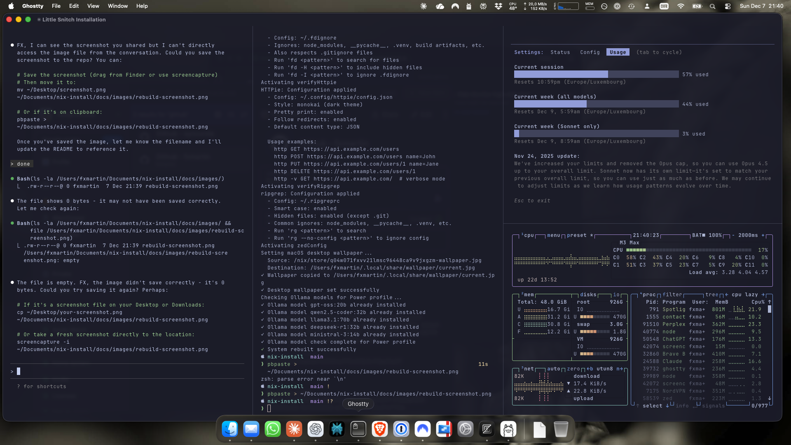

# Nix-Darwin MacBook Setup System

> **Status**: 98.4% Complete (122/124 stories) | **Version**: 1.0.0 | **🎉 2 MacBooks Running!**

**Four MacBooks. One config. Zero drift.**

I got tired of my machines slowly becoming strangers — different tools here, tweaked settings there, no idea what I changed six months ago. So I built this.

One git repo defines everything. Push a change, rebuild, and all machines stay perfectly in sync. Fresh MacBook? 30 minutes to identical setup.

The stack: **Nix + nix-darwin + Home Manager** for declarative, atomic, rollback-capable configuration — plus an AI-powered release monitor that opens GitHub issues before I even know updates exist.


*A `rebuild` in action — Ghostty terminal with Catppuccin theme, iStat Menus monitoring, and system-wide consistency.*

---

## Quick Start

Run this single command on a fresh macOS installation:

```bash
curl -fsSL https://raw.githubusercontent.com/fxmartin/nix-install/main/setup.sh | bash
```

**Installation time**: ~30 minutes (mostly automated, a few prompts)

### What happens during installation

1. **Pre-flight checks** — Verifies macOS version, disk space, internet
2. **User prompts** — Enter your name, email, and GitHub username
3. **Profile selection** — Choose Standard (MacBook Air) or Power (MacBook Pro)
4. **Xcode CLI tools** — Installs automatically if needed
5. **Nix installation** — Multi-user Nix with flakes enabled
6. **SSH key setup** — Generates key, you add it to GitHub (prompted with instructions)
7. **Repository clone** — Clones this repo to `~/.config/nix-install`
8. **System build** — Runs `darwin-rebuild` to configure everything
9. **Post-install summary** — Shows next steps for license activation

### Requirements

- **macOS**: Sonoma 14.0+ (Apple Silicon or Intel)
- **Disk space**: 35GB (Standard) or 120GB (Power profile)
- **Internet**: Required throughout installation
- **GitHub account**: For SSH key authentication

### Manual steps after installation

1. **Restart Terminal** or run `source ~/.zshrc`
2. **Enable FileVault** if not already enabled (System Settings → Privacy & Security)
3. **Mac App Store apps** (if you skipped during install):
   ```bash
   # Note: mas 4.0+ requires sudo for install commands (auto-prompts)
   mas install 6714467650  # Perplexity
   mas install 302584613   # Kindle
   mas install 890031187   # Marked 2
   mas install 310633997   # WhatsApp
   ```
4. **Activate licenses** — See [Licensed Apps Guide](./docs/licensed-apps.md):
   - 1Password, Dropbox, NordVPN (sign in)
   - iStat Menus, Parallels (enter license key)
   - Zoom, Webex (sign in)
   - Office 365 (Microsoft account sign-in)

---

## Common Commands

After installation, manage your system with these aliases:

| Command | Description |
|---------|-------------|
| `rebuild` | Apply config changes (uses locked package versions) |
| `update` | Update flake.lock + rebuild (the ONLY way to update apps) |
| `gc` | Garbage collection (delete old generations) |
| `cleanup` | Full cleanup (GC + store optimization) |
| `health-check` | System health report |
| `brew-upgrade` | Update Homebrew packages |
| `release-monitor` | Run AI-powered update checker |

**Rollback** if something breaks:
```bash
darwin-rebuild --rollback  # Instant rollback to previous generation
```

---

## Update Philosophy

**All app updates are controlled via commands only. Auto-updates are disabled everywhere.**

### Why No Auto-Updates?

| Benefit | Explanation |
|---------|-------------|
| **Reproducibility** | Same config = same versions = identical system state across machines |
| **Control** | You choose when to update, not apps updating randomly |
| **Testing** | Update one machine first, verify it works, then update others |
| **Rollback** | If an update breaks something, instant rollback to previous state |
| **No Surprises** | Apps don't change behavior unexpectedly mid-workday |

### rebuild vs update

```
┌─────────────────────────────────────────────────────────────────┐
│  rebuild                           │  update                    │
├─────────────────────────────────────────────────────────────────┤
│  • Uses current flake.lock         │  • Updates flake.lock      │
│  • Same package versions           │  • Gets latest versions    │
│  • Fast (packages cached)          │  • Downloads new packages  │
│  • For config changes only         │  • THE way to update apps  │
└─────────────────────────────────────────────────────────────────┘
```

**`rebuild`** — Apply configuration changes
- Use after editing any `.nix` file
- Adds/removes apps, changes settings, updates dotfiles
- Package versions stay the same (from `flake.lock`)
- Fast because most packages are already cached

**`update`** — Update all packages and rebuild
- Updates `flake.lock` to latest versions from nixpkgs
- Then runs a rebuild with new versions
- This is the **ONLY** way apps update
- Run weekly or when you want latest versions

### Checking for Available Updates

```bash
cd ~/Documents/nix-install
nix flake metadata                      # See current input versions
nix flake update --dry-run              # Preview what would update
```

### Rollback if Something Breaks

Every `rebuild` creates a new "generation" you can rollback to:

```bash
darwin-rebuild --list-generations       # List all available generations
darwin-rebuild --rollback               # Rollback to previous generation
```

Rollback is instant — no re-downloading, just switches symlinks.

### Multi-Machine Update Strategy

1. Run `update` on **one machine** first (e.g., MacBook Pro)
2. Test for a day — verify apps work, no regressions
3. If good, run `update` on other machines
4. If broken, `rollback` and wait for fix upstream

---

## What Gets Installed

### Applications (50+ apps)

**AI & LLM Tools**:
- Claude Desktop, Claude Code CLI, ChatGPT, Perplexity
- Ollama with models (1 for Standard, 4 for Power)
- LM Studio (local LLM GUI)

**Development**:
- Zed Editor (GPU-accelerated, Catppuccin themed)
- Ghostty terminal (Catppuccin themed)
- Python 3.12 + uv + ruff + black + mypy + pylint
- Podman + Podman Desktop (rootless containers)
- Git + Git LFS + GitHub CLI
- Node.js (for npx/npm tooling)
- Language servers (pyright, typescript, bash, yaml, etc.)

**Browsers**: Brave

**Productivity**:
- Raycast (launcher)
- 1Password + 1Password for Safari
- Dropbox (cloud storage)
- Calibre, Kindle, Marked 2, Keka
- Office 365 (Word, Excel, PowerPoint, Outlook, OneNote, Teams)
- reMarkable desktop

**Communication**: WhatsApp, Zoom, Webex

**Media**: VLC

**Security**: NordVPN, Tailscale, Little Snitch

**System**: iStat Menus, OnyX, f.lux, btop, gotop, macmon

**Power Profile Only**: Parallels Desktop, additional Ollama models

### System Configuration

- **Finder**: List view, show hidden files, path bar, status bar
- **Dock**: Auto-hide, small icons, no recent apps
- **Trackpad**: Tap-to-click, three-finger drag, natural scrolling off
- **Security**: Firewall enabled, stealth mode, FileVault prompt
- **Keyboard**: Fast key repeat, no auto-correct

### Shell Environment

- **Zsh** with Oh My Zsh (git plugin) + zsh-autosuggestions + syntax highlighting
- **Starship** prompt with Nerd Font icons (replaces Oh My Zsh themes)
- **FZF** fuzzy finder (Ctrl+R history, Ctrl+T files, Alt+C directories)
- **Zoxide** for smart directory jumping (frecency-based `z` command)
- **Modern CLI**: ripgrep, bat, eza, fd, httpie, tldr, mosh

### Theming

- **Catppuccin** Mocha (dark) and Latte (light)
- Auto-switches with macOS appearance
- Consistent across Ghostty, Zed, and shell

---

## Two Installation Profiles

| Feature | Standard | Power |
|---------|----------|-------|
| **Target** | MacBook Air | MacBook Pro M3 Max |
| **Apps** | 47+ | 51+ |
| **Ollama Models** | 1 (~12GB) | 4 (~80GB) |
| **Parallels Desktop** | No | Yes |
| **Disk Usage** | ~35GB | ~120GB |

### Package Sources (Priority Order)

1. **Nix** (nixpkgs-unstable): CLI tools, Python, Podman, dev tools
2. **Homebrew Casks**: GUI apps (Zed, Ghostty, Arc, Claude Desktop)
3. **Mac App Store**: Only when no alternative (Kindle, WhatsApp)

### Key Design Principles

- **Declarative**: Configuration IS the documentation—no drift
- **Atomic Updates**: All-or-nothing with instant rollback
- **No Auto-Updates**: All updates via `rebuild`/`update` only
- **Stylix Theming**: System-wide Catppuccin with auto light/dark
- **AI Release Monitor**: Weekly scans → GitHub issues → Claude Code integration

---

## Automated Maintenance

The system runs **automated maintenance** via LaunchAgents:

| Schedule | Task | Description |
|----------|------|-------------|
| Daily 3:00 AM | Garbage Collection | Removes old generations, frees disk space |
| Daily 3:30 AM | Store Optimization | Deduplicates Nix store via hard links |
| Sunday 7:00 AM | Release Monitor | AI-powered update analysis (see below) |
| Sunday 8:00 AM | Weekly Digest | Health report email |

### Weekly Maintenance Digest (Example)

```
========================================
Weekly Maintenance Digest - MacBook-Pro
========================================
Report Period: 2025-11-29 to 2025-12-06

MAINTENANCE ACTIVITY
--------------------
Garbage Collection Runs: 7
Store Optimization Runs: 7

SYSTEM STATE
------------
Nix Store Size: 45G
Disk Free (/nix): 380G
System Generations: 12

SECURITY STATUS
---------------
FileVault: Enabled ✅
Firewall: Enabled ✅

RECOMMENDATIONS
---------------
• No issues detected. System is healthy! ✅
```

---

## AI-Powered Release Monitor

A unique feature: the system **proactively suggests improvements** rather than just maintaining config.

**Weekly pipeline** (Sunday 7 AM):
1. **Fetch** release notes from Homebrew, Nix, tracked tools
2. **Analyze** with Claude CLI → categorize by priority
3. **Create GitHub issues** with smart deduplication
4. **Email summary** grouped by category

### Release Monitor Email (Example)

```
=======================================================
        WEEKLY RELEASE MONITOR REPORT
=======================================================
Generated: Sun Dec 6 07:00:00 2025
Host: MacBook-Pro

STATUS: ATTENTION REQUIRED: Security updates found

SUMMARY
-------
🔴 Security Updates: 1
🟠 Breaking Changes: 0
🟢 New Features: 2
🤖 Ollama Models: 1
🔵 Notable Updates: 3

GITHUB ISSUES CREATED
---------------------
🔴 Security Updates:
  ca-certificates: https://github.com/fxmartin/nix-install/issues/64

🟢 New Features:
  ghostty: https://github.com/fxmartin/nix-install/issues/65

🔵 Notable Updates:
  python: https://github.com/fxmartin/nix-install/issues/66

NEXT STEPS
----------
  - Review security updates immediately
  - Consider adopting new features
```

### Claude Code Integration

```bash
/release-updates          # List pending updates
/plan-release-update 64   # Get implementation plan for issue #64
```

**Priority categories**: Security (HIGH) → Breaking Changes (HIGH) → New Features (MEDIUM) → Notable Updates (LOW)

### Get Shit Done (GSD)

The system includes **[Get Shit Done](https://github.com/glittercowboy/get-shit-done)** — a meta-prompting and context engineering system for Claude Code that solves context degradation in long sessions.

**Key GSD commands** (run in Claude Code):
```bash
/gsd:new-project          # Start new project with context gathering
/gsd:create-roadmap       # Generate phased roadmap from requirements
/gsd:plan-phase 1         # Create atomic task plans for phase
/gsd:execute-phase 1      # Execute with parallel subagents (walk away automation)
/gsd:progress             # Check current status and next steps
/gsd:help                 # Full command reference
```

**Why it works**: Each task runs in a fresh subagent context (200k tokens), preventing the quality degradation that happens as Claude fills its context window. Atomic git commits per task enable precise rollback.

**Update GSD**: `npx get-shit-done-cc@latest`

---

## Project Structure

```
nix-install/
├── flake.nix                 # System definition (Standard/Power profiles)
├── bootstrap.sh              # Interactive installer (9 phases)
├── darwin/                   # System-level nix-darwin configs
│   ├── configuration.nix     # System packages, PATH
│   ├── homebrew.nix          # Casks, brews, Mac App Store
│   ├── macos-defaults.nix    # Finder, Dock, trackpad, security
│   ├── maintenance.nix       # GC, optimization, LaunchAgents
│   └── stylix.nix            # Catppuccin theming
├── home-manager/modules/     # User-level dotfiles
│   ├── shell.nix             # Zsh + Oh My Zsh + Starship + FZF
│   ├── git.nix               # Git config + LFS
│   ├── ghostty.nix           # Terminal with Catppuccin
│   ├── zed.nix / vscode.nix  # Editor configs
│   ├── python.nix            # Python + uv + ruff
│   ├── podman.nix            # Container development
│   └── claude-code.nix       # Claude Code CLI + MCP servers + GSD
├── scripts/                  # Maintenance & monitoring
│   ├── health-check.sh       # System health validation
│   ├── release-monitor.sh    # AI-powered update checker
│   └── weekly-maintenance-digest.sh
└── docs/                     # Documentation (Epic-07)
```

---

## Progress

| Epic | Focus | Status |
|------|-------|--------|
| **01** | Bootstrap & Installation | ✅ 100% |
| **02** | Application Installation | ✅ 100% |
| **03** | System Configuration | ✅ 100% |
| **04** | Development Environment | ✅ 100% |
| **05** | Theming & Visual Consistency | ✅ 100% |
| **06** | Maintenance & Monitoring | ✅ 100% |
| **07** | Documentation & UX | ✅ 100% |
| **NFR** | Non-Functional Requirements | 🟢 87% |

**🎉 Milestone (2025-12-07)**: MacBook Pro M3 Max successfully running Power profile!
- Shell startup: 259ms (target <500ms) ✅
- Rebuild time: 14 seconds (target <5min) ✅
- All 27 Homebrew apps installed, 5 Ollama models verified

### Project Statistics

| Category | Metric |
|----------|--------|
| **Commits** | 448 (72 feat, 56 fix, 24 docs) |
| **Development** | 18 active days, ~78 hours |
| **Code** | 19K lines (Nix + Shell + Python) |
| **Tests** | 1,140 test cases (16 BATS files) |
| **Documentation** | 46K lines across 137 markdown files |
| **GitHub Issues** | 60 total (83% closed) |
| **Packages** | 25 casks, 4 brews, 4 MAS, 50+ Nix |

**Next**: MacBook Air migrations (Phase 11)

---

## Documentation

| Document | Purpose |
|----------|---------|
| [REQUIREMENTS.md](./docs/REQUIREMENTS.md) | Complete PRD (1,700+ lines) |
| [STORIES.md](./STORIES.md) | Epic overview & story tracking |
| [/stories/](./stories/) | Detailed epic files (source of truth) |
| [CLAUDE.md](./CLAUDE.md) | Developer guidance & architecture |
| [/docs/apps/](./docs/apps/) | Per-app configuration guides |

---

## Technologies

- **[Nix](https://nixos.org/)** + **[nix-darwin](https://github.com/LnL7/nix-darwin)** + **[Home Manager](https://github.com/nix-community/home-manager)**: Declarative system & dotfile management
- **[Stylix](https://github.com/danth/stylix)**: System-wide theming
- **[Claude Code](https://claude.ai/code)**: AI-assisted development & release monitoring

---

## Acknowledgments

- **[mlgruby/dotfile-nix](https://github.com/mlgruby/dotfile-nix)**: Reference implementation
- **Nix Community**: For the incredible ecosystem

---

**Built with**: Nix + nix-darwin + Home Manager + Stylix + Claude Code
