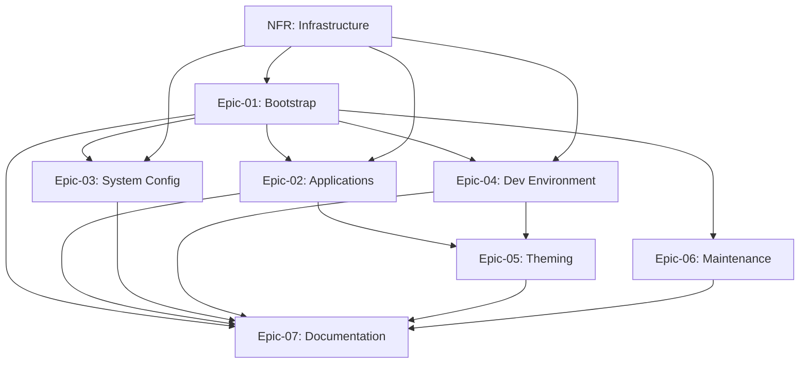

# USER STORIES - NIX-DARWIN MACBOOK SETUP SYSTEM

## Document Purpose
Comprehensive user story organization for the Nix-Darwin MacBook Setup System with modular epic structure. This document serves as the single source of truth for all epic, feature, and user story definitions, progress tracking, and sprint planning.

## User Personas

### Primary Personas

#### FX (Power User with Multiple Machines)
- **Role**: Technical professional managing 3 MacBooks with periodic reinstalls
- **Goals**:
  - Automate MacBook setup to reduce time from 4+ hours to <30 minutes
  - Maintain consistency across all machines
  - Version control entire system configuration
  - Enable quick recovery from system issues via rollback
- **Pain Points**:
  - Manual setup is time-consuming and error-prone
  - Configuration drift between machines
  - Forgotten critical settings during reinstalls
  - No rollback mechanism when changes break the system
  - Documentation gets out of sync with reality
- **Context**:
  - Split usage: Office 365 work + weekend Python development
  - Owns MacBook Pro M3 Max + 2 MacBook Air models
  - Values automation, consistency, and minimal manual intervention

## Epic Overview

| Epic ID | Epic Name | Business Value | Story Count | Total Points | Priority |
|---------|-----------|----------------|-------------|--------------|----------|
| Epic-01 | Bootstrap & Installation System | Automated one-command installation | 19 | 113 | Must Have |
| Epic-02 | Application Installation & Configuration | Declarative app management across profiles | 22 | 113 | Must Have |
| Epic-03 | System Configuration & macOS Preferences | Automated macOS system preferences | 12 | 68 | Must Have |
| Epic-04 | Development Environment & Shell | Complete dev tooling setup | 18 | 97 | Must Have |
| Epic-05 | Theming & Visual Consistency | System-wide consistent theming | 8 | 42 | Should Have |
| Epic-06 | Maintenance & Monitoring | Self-maintaining system with monitoring | 10 | 55 | Must Have |
| Epic-07 | Documentation & User Experience | Complete user documentation | 8 | 34 | Must Have |
| NFR | Non-Functional Requirements | Performance, security, reliability | 15 | 79 | Must Have |

## Epic Navigation
- **[Epic-01: Bootstrap & Installation System](./stories/epic-01-bootstrap-installation.md)** - One-command installation with SSH key management and profile selection
- **[Epic-02: Application Installation & Configuration](./stories/epic-02-application-installation.md)** - Declarative application management across Standard and Power profiles
- **[Epic-03: System Configuration & macOS Preferences](./stories/epic-03-system-configuration.md)** - Automated macOS system preferences (Finder, security, trackpad, etc.)
- **[Epic-04: Development Environment & Shell](./stories/epic-04-development-environment.md)** - Complete development tooling with Zsh, Python, Podman, Git
- **[Epic-05: Theming & Visual Consistency](./stories/epic-05-theming-visual-consistency.md)** - Stylix-based system-wide theming with Catppuccin
- **[Epic-06: Maintenance & Monitoring](./stories/epic-06-maintenance-monitoring.md)** - Automated garbage collection, optimization, and health monitoring
- **[Epic-07: Documentation & User Experience](./stories/epic-07-documentation-user-experience.md)** - Complete documentation for installation, troubleshooting, and customization
- **[Non-Functional Requirements](./stories/non-functional-requirements.md)** - Performance, security, reliability, maintainability

## MVP Summary

### MVP Criteria
**Business Value Threshold**: All P0 (Must Have) requirements must be implemented
**Technical Feasibility**: Bootstrap works in VM with zero manual intervention (except license activations)
**User Journey Completeness**: Fresh macOS → fully configured system in <30 minutes
**Time Constraints**: 6-8 week delivery timeline with VM testing before physical hardware

### MVP Scope
**Total MVP Stories**: 112
**Total MVP Points**: 601
**Estimated Duration**: 6-8 weeks (implementation) + 2 weeks (migrations)

### MVP Epic Breakdown
| Epic | MVP Stories | MVP Points | Completed Stories | Completed Points | % Complete |
|------|-------------|------------|-------------------|------------------|------------|
| Epic-01 | 19/19 | 113/113 | 16 | 101 | 89.4% |
| Epic-02 | 22/22 | 113/113 | 0 | 0 | 0% |
| Epic-03 | 12/12 | 68/68 | 0 | 0 | 0% |
| Epic-04 | 18/18 | 97/97 | 0 | 0 | 0% |
| Epic-05 | 8/8 | 42/42 | 0 | 0 | 0% |
| Epic-06 | 10/10 | 55/55 | 0 | 0 | 0% |
| Epic-07 | 8/8 | 34/34 | 0 | 0 | 0% |
| NFR | 15/15 | 79/79 | 0 | 0 | 0% |

**Notes**:
- **2025-11-10**: Epic-01 reduced from 108 to 105 points after Story 01.6-002 scope change
- **2025-11-11**: Epic-01 increased to 113 points after adding Story 01.1-004 (Modular Bootstrap Architecture, 8 points, deferred to post-Epic-01)

## Project Metrics
- **Total Stories**: 112
- **Total Story Points**: 601
- **Average Story Size**: 5.4 points
- **Completed Stories**: 16 (14.3%)
- **Completed Points**: 101 (16.8%)
- **MVP Completion**: 14.3% by stories, 16.8% by points

## Story Dependencies

### Cross-Epic Dependencies

### Critical Path
1. **NFR**: Infrastructure and security foundations (Nix installation, flake structure)
2. **Epic-01**: Bootstrap system must complete first (enables all other epics)
3. **Epic-02**: Application installation (builds on bootstrap)
4. **Epic-03**: System configuration (parallel with Epic-02)
5. **Epic-04**: Development environment (parallel with Epic-02/03)
6. **Epic-05**: Theming (requires applications to be installed)
7. **Epic-06**: Maintenance (can run parallel with Epic-04/05)
8. **Epic-07**: Documentation (final epic, documents all previous work)

## Story Estimation and Sizing

### Estimation Methodology
**Approach**: Fibonacci Sequence (1, 2, 3, 5, 8, 13, 21)
**Reference Stories**: Epic-01 Story 001 (User prompts) = 3 points (baseline medium complexity)
**Estimation Factors**:
- Technical complexity (Nix/Bash scripting knowledge required)
- Business logic complexity (error handling, validation)
- Integration requirements (multiple tools working together)
- Testing requirements (VM testing, physical hardware validation)
- Documentation requirements

### Story Point Distribution
| Story Points | Complexity Level | Story Count | Total Points |
|--------------|------------------|-------------|--------------|
| 1 | Trivial | 8 | 8 |
| 2 | Simple | 17 | 34 |
| 3 | Medium | 35 | 105 |
| 5 | Complex | 30 | 150 |
| 8 | Very Complex | 14 | 112 |
| 13 | Highly Complex | 4 | 52 |

**Total Story Points**: 593 (revised from 596 after Story 01.6-002 update)
**Estimated Sprints** (assuming 25-30 points per sprint): 19-23 sprints (9-11 weeks with 2-week sprints)

### Sprint Planning Notes
- **Week 1-2**: Foundation (Epic-01 + NFR infrastructure)
- **Week 3-4**: Applications & System Config (Epic-02 + Epic-03)
- **Week 4-5**: Development Environment (Epic-04)
- **Week 5-6**: Theming & Maintenance (Epic-05 + Epic-06)
- **Week 6**: Documentation (Epic-07)
- **Week 6**: VM Testing (Phase 9)
- **Week 7**: MacBook Pro M3 Max migration (Phase 10)
- **Week 8**: MacBook Air migrations (Phase 11)

## Story Management
- **Backlog Refinement**: Weekly epic review during implementation phases
- **Story Updates**: Maintained in individual epic files
- **Dependencies**: Cross-referenced between epics
- **Sprint Planning**: Use epic files for detailed planning

## Quality Standards
- All stories must deliver measurable business value
- Acceptance criteria must be specific, testable, and complete
- Story sizing must support effective sprint planning
- Dependencies must be clearly identified and managed
- Documentation must support both development execution and stakeholder communication
- All stories follow INVEST principles (Independent, Negotiable, Valuable, Estimable, Small, Testable)

## Success Criteria

### Definition of "MVP Complete"
1. ✅ VM testing successful: Bootstrap works in fresh VM with zero manual intervention
2. ✅ All 3 MacBooks migrated to Nix-based config (MacBook Pro M3 Max + 2 MacBook Airs)
3. ✅ Bootstrap script proven on both VM and physical hardware without manual intervention (except license entry)
4. ✅ Documentation complete: Non-technical user can follow README and succeed
5. ✅ All P0 requirements met: Apps installed, system configured, shell working
6. ✅ First rebuild successful: User can make a config change and rebuild without help
7. ✅ No blockers: All critical workflows functional (Python dev, Office 365 work, AI tools)
8. ✅ Profile verification: Power vs Standard profiles correctly differentiated

### Success Metrics
- **Time to fully configured system**: <30 minutes (vs 4+ hours manual)
- **Configuration consistency**: 100% identical setup across same-profile machines
- **Bootstrap success rate**: >90% first-time success
- **User confidence score**: >8/10 "I can rebuild my Mac confidently"
- **Time savings per reinstall**: 3-4 hours saved per reinstall

## Notes for Development Team

### Critical Constraints
- **CRITICAL - NO AUTOMATED TESTING BY CLAUDE**: Claude must NEVER run tests, execute bootstrap scripts, or perform any system configuration changes. ALL testing is done MANUALLY by FX only.
- **No auto-updates**: All app updates ONLY via `rebuild` or `update` commands
- **VM testing required**: Never test directly on physical MacBooks until VM testing passes
- **nixpkgs-unstable**: Use unstable channel for latest packages, flake.lock ensures reproducibility
- **Stylix theming**: Ghostty and Zed must use matching Catppuccin themes via Stylix
- **Two profiles only**: Standard (Air) and Power (Pro M3 Max)
- **Public repo**: Configuration is public (exclude secrets, use SOPS/age for P1 phase)

### Reference Materials
- **Primary**: docs/REQUIREMENTS.md (comprehensive PRD)
- **Reference**: mlgruby-repo-for-reference/dotfile-nix/ (production example)
- **User preferences**: ~/.claude/CLAUDE.md, ~/.claude/docs/*.md
- **Ghostty config**: config/config.ghostty (template for Home Manager)

### Story Management Protocol
All story progress MUST be updated in the individual epic files located in `/stories/` directory. These files constitute the single source of truth for epic, feature, and user story definitions, progress tracking, and sprint planning. See updated CLAUDE.md for detailed story management protocol.
