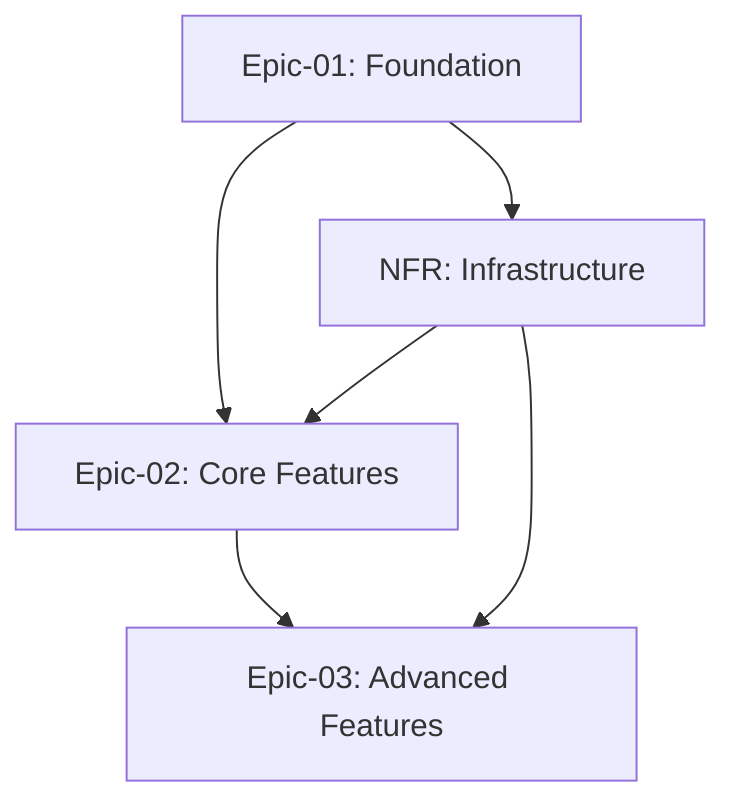

# Claude Code CLI Prompt: Modular AGILE STORIES Generation

## Objective
You are an expert AGILE product manager and story writer. Your task is to read the Product Requirements Document in REQUIREMENTS.md and create a modular story structure with a main STORIES.md overview and separate epic files in a `docs/stories` directory.

## Context
This process transforms product requirements into actionable user stories organized in a modular structure that development teams can implement effectively. The resulting story files will serve as the definitive story backlog for sprint planning, development execution, and stakeholder communication.

## Output Structure
```
docs/
├── STORIES.md (overview and navigation)
└── stories/
    ├── epic-01-[epic-name].md
    ├── epic-02-[epic-name].md
    ├── epic-03-[epic-name].md
    └── non-functional-requirements.md
```

## Instructions

### Step 1: Requirements Analysis
1. **Carefully analyze the docs/REQUIREMENTS.md file** to understand:
   - Product vision and business objectives
   - User personas and target audience
   - Functional and non-functional requirements
   - Technical constraints and dependencies
   - Success criteria and acceptance thresholds

2. **Identify story categories**:
   - Core user functionality stories
   - Administrative and management stories
   - Integration and API stories
   - Infrastructure and DevOps stories
   - Quality and performance stories

### Step 2: User Story Creation
**For each identified requirement, create user stories following the standard format:**
```
As a [user type/persona], I want [functionality] so that [business value/benefit]
```

**Ensure each story follows INVEST criteria:**
- **Independent**: Can be developed standalone
- **Negotiable**: Open to discussion and refinement
- **Valuable**: Delivers clear business value
- **Estimable**: Can be sized and estimated
- **Small**: Fits within a single sprint
- **Testable**: Has clear acceptance criteria

### Step 3: Create Main STORIES.md (Overview Only)

Generate a streamlined STORIES.md with this structure:

```markdown
# USER STORIES - PROJECT OVERVIEW

## Document Purpose
Comprehensive user story organization for [Project Name] with modular epic structure.

## User Personas
### Primary Personas
#### [Persona Name 1]
- **Role**: [User role description]
- **Goals**: [Primary objectives and motivations]
- **Pain Points**: [Current challenges and frustrations]
- **Context**: [Usage scenarios and environment]

#### [Persona Name 2]
- **Role**: [User role description]
- **Goals**: [Primary objectives and motivations]
- **Pain Points**: [Current challenges and frustrations]
- **Context**: [Usage scenarios and environment]

[Continue for all relevant personas]

## Epic Overview

| Epic ID | Epic Name | Business Value | Story Count | Total Points | Priority |
|---------|-----------|----------------|-------------|--------------|----------|
| Epic-01 | [Epic Name] | [Value Statement] | 12 | 85 | Must Have |
| Epic-02 | [Epic Name] | [Value Statement] | 8 | 60 | Must Have |
| Epic-03 | [Epic Name] | [Value Statement] | 15 | 120 | Should Have |
| NFR | Non-Functional Requirements | [Value Statement] | 10 | 55 | Must Have |

## Epic Navigation
- **[Epic-01: Epic Name](./stories/epic-01-[epic-name].md)** - [Brief description]
- **[Epic-02: Epic Name](./stories/epic-02-[epic-name].md)** - [Brief description]
- **[Epic-03: Epic Name](./stories/epic-03-[epic-name].md)** - [Brief description]
- **[Non-Functional Requirements](./stories/non-functional-requirements.md)** - Performance, security, accessibility

## MVP Summary

### MVP Criteria
**Business Value Threshold**: [Minimum value requirement]
**Technical Feasibility**: [Implementation complexity limits]
**User Journey Completeness**: [End-to-end functionality requirements]
**Time Constraints**: [Delivery timeline considerations]

### MVP Scope
**Total MVP Stories**: [Number]
**Total MVP Points**: [Points]
**Estimated Duration**: [Sprints/Weeks]

### MVP Epic Breakdown
| Epic | MVP Stories | MVP Points | % of Epic |
|------|-------------|------------|-----------|
| Epic-01 | 8/12 | 55/85 | 65% |
| Epic-02 | 6/8 | 45/60 | 75% |
| Epic-03 | 4/15 | 30/120 | 25% |
| NFR | 8/10 | 45/55 | 82% |

## Project Metrics
- **Total Stories**: [Number]
- **Total Story Points**: [Points]
- **Average Story Size**: [Points]
- **Ready for Development**: [%]
- **MVP Completion**: [%]

## Story Dependencies

### Cross-Epic Dependencies


### Critical Path
1. **Epic-01**: Foundation stories must complete first
2. **NFR**: Infrastructure enablers required early
3. **Epic-02**: Core business functionality
4. **Epic-03**: Enhancement and optimization features

## Story Estimation and Sizing

### Estimation Methodology
**Approach**: [Planning Poker/T-shirt Sizing/Fibonacci Sequence]
**Reference Stories**: [Baseline stories for comparison]
**Estimation Factors**:
- Technical complexity
- Business logic complexity
- UI/UX complexity
- Integration requirements
- Testing requirements

### Story Point Distribution
| Story Points | Complexity Level | Story Count | Total Points |
|--------------|------------------|-------------|--------------|
| 1 | Trivial | 15 | 15 |
| 2 | Simple | 25 | 50 |
| 3 | Medium | 30 | 90 |
| 5 | Complex | 20 | 100 |
| 8 | Very Complex | 10 | 80 |

**Total Story Points**: 335
**Estimated Sprints** (assuming 25 points per sprint): 14 sprints

## Story Management
- **Backlog Refinement**: Weekly epic review
- **Story Updates**: Maintained in individual epic files
- **Dependencies**: Cross-referenced between epics
- **Sprint Planning**: Use epic files for detailed planning

## Quality Standards
- All stories must deliver measurable business value
- Acceptance criteria must be specific, testable, and complete
- Story sizing must support effective sprint planning
- Dependencies must be clearly identified and managed
- Documentation must support both development execution and stakeholder communication
```

### Step 4: Create Individual Epic Files

**For each epic, create `docs/stories/epic-[number]-[name].md` with this structure:**

```markdown
# Epic [Number]: [Epic Name]

## Epic Overview
**Epic ID**: Epic-[Number]
**Epic Description**: [Comprehensive description of business capability]
**Business Value**: [Clear articulation of business benefit]
**User Impact**: [How this epic serves user needs]
**Success Metrics**: [Measurable outcomes for epic completion]

## Epic Scope
**Total Stories**: [Number]
**Total Story Points**: [Points]
**MVP Stories**: [Number] ([X]% of epic)
**Priority Level**: [Must/Should/Could/Won't Have]
**Target Release**: [Release version or date]

## Features in This Epic

### Feature [Epic].[Feature]: [Feature Name]
**Feature Description**: [Detailed feature explanation]
**User Value**: [Direct benefit to users]
**Story Count**: [Number]
**Story Points**: [Total]
**Priority**: [High/Medium/Low]
**Complexity**: [Story points or effort estimation]

#### Stories in This Feature

##### Story [Epic].[Feature]-001: [Story Title]
**User Story**: As a [persona], I want [functionality] so that [benefit]

**Priority**: Must Have / Should Have / Could Have / Won't Have
**Story Points**: [Estimation]
**Sprint**: [Target sprint or "Backlog"]

**Acceptance Criteria**:
- **Given** [initial context/state]
- **When** [action or event occurs]
- **Then** [expected outcome]
- **And** [additional expected outcome]

**Additional Requirements**:
- [Any specific technical or business constraints]
- [Performance requirements if applicable]
- [Security considerations if relevant]

**Technical Notes**:
- [Implementation considerations]
- [Architecture decisions]
- [Performance requirements]

**Definition of Done**:
- [ ] Code implemented and peer reviewed
- [ ] Unit tests written and passing
- [ ] Integration tests passing
- [ ] UI/UX approved by design team
- [ ] Accessibility requirements met
- [ ] Documentation updated
- [ ] QA testing completed
- [ ] Product Owner acceptance obtained

**Dependencies**:
- [Other story IDs or external dependencies]

**Risk Level**: High / Medium / Low
**Risk Mitigation**: [If high/medium risk]

---

##### Story [Epic].[Feature]-002: [Story Title]
**User Story**: As a [persona], I want [functionality] so that [benefit]

[Continue pattern for all stories in the feature]

### Feature [Epic].[Feature+1]: [Next Feature Name]
[Continue pattern for all features in epic]

## Epic Dependencies

### Dependencies on Other Epics
- **Epic-[X]**: [Specific dependency description and rationale]
- **External**: [External system dependencies]

### Stories This Epic Enables
- Epic-[Y], Story [Y].[Z]-[###]: [Description of what this enables]

### Stories This Epic Blocks
- Epic-[Y], Story [Y].[Z]-[###]: [Description of what depends on this]

## Epic Delivery Planning

### Sprint Breakdown
| Sprint | Stories | Story Points | Sprint Goal |
|--------|---------|--------------|-------------|
| Sprint X | [Story IDs] | [Points] | [Specific sprint objective] |
| Sprint Y | [Story IDs] | [Points] | [Specific sprint objective] |
| Sprint Z | [Story IDs] | [Points] | [Specific sprint objective] |

### Delivery Milestones
- **Milestone 1**: [Date] - [Deliverable description]
- **Milestone 2**: [Date] - [Deliverable description]
- **Epic Complete**: [Date] - [Final deliverable]

### Risk Assessment
**High Risk Items**:
- [Risk description and mitigation strategy]
- [Risk description and mitigation strategy]

**Dependencies Timeline**:
- [Critical path items with dates]
- [Blocking dependencies and resolution plans]

## Epic Progress Tracking

### Completion Status
- **Stories Completed**: [X] of [Total] ([Percentage]%)
- **Story Points Completed**: [X] of [Total] ([Percentage]%)
- **MVP Stories Completed**: [X] of [Total] ([Percentage]%)

### Sprint Progress
| Sprint | Planned Points | Completed Points | Stories Done | Status |
|--------|----------------|------------------|--------------|--------|
| Sprint 1 | 25 | 23 | 4/5 | Complete |
| Sprint 2 | 30 | 0 | 0/6 | Planned |

## Epic Acceptance Criteria
- [ ] All MVP stories completed and accepted
- [ ] Success metrics achieved and validated
- [ ] User acceptance testing passed
- [ ] Performance benchmarks met
- [ ] Security requirements validated
- [ ] Documentation complete and reviewed
- [ ] Integration testing passed
- [ ] Production deployment successful

## Story Validation Checklist

### Quality Assurance for Each Story
- [ ] Follows proper user story format
- [ ] Has clear, testable acceptance criteria
- [ ] Includes all necessary context and constraints
- [ ] Sized appropriately for single sprint
- [ ] Dependencies clearly identified
- [ ] Business value articulated
- [ ] Persona alignment verified
- [ ] Technical feasibility confirmed

### Epic Health Metrics
- **Story Readiness**: [%] of stories meeting definition of ready
- **Dependency Coverage**: All dependencies identified and managed
- **Estimation Confidence**: Team confidence in story point estimates
- **Acceptance Criteria Quality**: Clear, testable, and complete criteria
```

### Step 5: Create Non-Functional Requirements File

**Create `docs/stories/non-functional-requirements.md`:**

```markdown
# Non-Functional Requirements

## Overview
**Purpose**: System-wide quality attributes and constraints that apply across all functional epics
**Priority**: Critical foundation for MVP and all subsequent releases
**Total Stories**: [Number]
**Total Story Points**: [Points]

## Performance Requirements

### Story NFR-PERF-001: System Response Time
**User Story**: As a [user], I want the system to respond quickly so that I can work efficiently without delays

**Acceptance Criteria**:
- **Given** normal system load (up to [X] concurrent users)
- **When** I perform any user action
- **Then** the system responds within 2 seconds for 95% of requests
- **And** no request takes longer than 5 seconds to complete
- **And** page load times are under 3 seconds

**Performance Benchmarks**:
- API response time: < 500ms for 90% of requests
- Database query time: < 200ms average
- UI rendering time: < 1 second

**Story Points**: 8
**Priority**: Must Have
**Sprint**: Sprint 1

---

### Story NFR-PERF-002: System Scalability
**User Story**: As a system administrator, I want the system to handle increasing user loads so that performance remains consistent as we grow

**Acceptance Criteria**:
- **Given** system is deployed in production
- **When** user load increases up to [X] concurrent users
- **Then** system maintains performance benchmarks
- **And** auto-scaling triggers activate appropriately
- **And** resource utilization stays below 80%

**Story Points**: 13
**Priority**: Should Have
**Sprint**: Sprint 3

## Security Requirements

### Story NFR-SEC-001: Data Encryption
**User Story**: As a [user], I want my data to be encrypted so that my privacy and security are protected

**Acceptance Criteria**:
- **Given** user data is transmitted or stored
- **When** data moves between client and server
- **Then** all data is encrypted using TLS 1.3
- **And** sensitive data at rest is encrypted using AES-256
- **And** encryption keys are properly managed and rotated

**Security Standards**:
- HTTPS everywhere
- Database encryption at rest
- API token encryption
- PII data masking in logs

**Story Points**: 8
**Priority**: Must Have
**Sprint**: Sprint 1

---

### Story NFR-SEC-002: Authentication and Authorization
**User Story**: As a system administrator, I want robust access controls so that only authorized users can access appropriate system features

**Acceptance Criteria**:
- **Given** a user attempts to access the system
- **When** they provide credentials
- **Then** authentication is verified against secure protocols
- **And** authorization rules are enforced for all resources
- **And** failed attempts are logged and monitored
- **And** session management follows security best practices

**Story Points**: 13
**Priority**: Must Have
**Sprint**: Sprint 2

### Story NFR-SEC-003: Audit Logging
**User Story**: As a compliance officer, I want comprehensive audit logs so that we can track all system activities for security and compliance

**Acceptance Criteria**:
- **Given** any user action occurs in the system
- **When** the action is performed
- **Then** it is logged with timestamp, user ID, action type, and result
- **And** logs are immutable and securely stored
- **And** log retention follows compliance requirements
- **And** sensitive data is not logged in plain text

**Story Points**: 5
**Priority**: Must Have
**Sprint**: Sprint 2

## Accessibility Requirements

### Story NFR-ACC-001: WCAG 2.1 AA Compliance
**User Story**: As a user with disabilities, I want the system to be accessible so that I can use all features effectively

**Acceptance Criteria**:
- **Given** any user interface element
- **When** accessed by assistive technologies
- **Then** it meets WCAG 2.1 AA standards
- **And** keyboard navigation works for all functionality
- **And** screen readers can interpret all content
- **And** color contrast ratios meet accessibility standards

**Accessibility Standards**:
- WCAG 2.1 AA compliance
- Section 508 compliance
- Keyboard navigation support
- Screen reader compatibility

**Story Points**: 8
**Priority**: Should Have
**Sprint**: Sprint 4

---

### Story NFR-ACC-002: Mobile Accessibility
**User Story**: As a mobile user with accessibility needs, I want the mobile interface to be fully accessible so that I can use the system on any device

**Acceptance Criteria**:
- **Given** the mobile interface
- **When** accessed with assistive technologies
- **Then** all features are accessible via mobile screen readers
- **And** touch targets meet minimum size requirements
- **And** gesture alternatives are provided for all interactions

**Story Points**: 5
**Priority**: Should Have
**Sprint**: Sprint 5

## Integration Requirements

### Story NFR-INT-001: API Standards Compliance
**User Story**: As an integration developer, I want standardized APIs so that external systems can integrate reliably

**Acceptance Criteria**:
- **Given** API endpoints are exposed
- **When** external systems call the APIs
- **Then** responses follow REST/GraphQL standards
- **And** error handling is consistent and informative
- **And** rate limiting is implemented and documented
- **And** API versioning strategy is implemented

**API Standards**:
- RESTful design principles
- OpenAPI 3.0 specification
- Consistent error response format
- Rate limiting (100 requests/minute per user)

**Story Points**: 8
**Priority**: Must Have
**Sprint**: Sprint 2

---

### Story NFR-INT-002: Third-Party Integration Resilience
**User Story**: As a system administrator, I want resilient third-party integrations so that external service failures don't break our system

**Acceptance Criteria**:
- **Given** third-party services are unavailable
- **When** our system attempts to connect
- **Then** graceful fallbacks are implemented
- **And** retry mechanisms handle temporary failures
- **And** circuit breakers prevent cascade failures
- **And** monitoring alerts on integration health

**Story Points**: 13
**Priority**: Should Have
**Sprint**: Sprint 3

## Infrastructure Requirements

### Story NFR-INF-001: High Availability
**User Story**: As a business stakeholder, I want system high availability so that users can access the system reliably

**Acceptance Criteria**:
- **Given** system is deployed in production
- **When** measured over a month
- **Then** uptime is 99.9% or higher
- **And** planned maintenance windows are scheduled
- **And** disaster recovery procedures are tested
- **And** failover mechanisms work automatically

**Availability Targets**:
- 99.9% uptime SLA
- < 4 hours planned maintenance per month
- < 15 minutes recovery time objective (RTO)
- < 1 hour recovery point objective (RPO)

**Story Points**: 13
**Priority**: Must Have
**Sprint**: Sprint 1

---

### Story NFR-INF-002: Monitoring and Observability
**User Story**: As a DevOps engineer, I want comprehensive monitoring so that I can proactively identify and resolve issues

**Acceptance Criteria**:
- **Given** the system is running
- **When** monitoring tools collect data
- **Then** application metrics are tracked and alerted
- **And** infrastructure metrics are monitored
- **And** log aggregation provides searchable insights
- **And** distributed tracing tracks request flows

**Monitoring Coverage**:
- Application performance metrics
- Infrastructure resource utilization
- Business metrics and KPIs
- Security event monitoring

**Story Points**: 8
**Priority**: Must Have
**Sprint**: Sprint 2

## Data Requirements

### Story NFR-DATA-001: Data Backup and Recovery
**User Story**: As a data administrator, I want reliable backup and recovery so that data is never permanently lost

**Acceptance Criteria**:
- **Given** data exists in the system
- **When** backup processes run
- **Then** all critical data is backed up daily
- **And** backup integrity is verified automatically
- **And** recovery procedures are tested monthly
- **And** point-in-time recovery is possible

**Story Points**: 8
**Priority**: Must Have
**Sprint**: Sprint 1

---

### Story NFR-DATA-002: Data Retention and Compliance
**User Story**: As a compliance officer, I want automated data retention so that we meet regulatory requirements

**Acceptance Criteria**:
- **Given** data retention policies are defined
- **When** data reaches retention limits
- **Then** data is automatically archived or deleted
- **And** deletion is logged and auditable
- **And** legal holds can prevent automated deletion
- **And** data export capabilities exist for compliance

**Story Points**: 5
**Priority**: Should Have
**Sprint**: Sprint 4

## NFR Progress Tracking

### Completion Status
- **Stories Completed**: [X] of [Total] ([Percentage]%)
- **Story Points Completed**: [X] of [Total] ([Percentage]%)
- **Critical NFRs Completed**: [X] of [Total] ([Percentage]%)

### Sprint Allocation
| Sprint | NFR Stories | Story Points | Focus Area |
|--------|-------------|--------------|------------|
| Sprint 1 | Security, Infrastructure | 29 | Foundation |
| Sprint 2 | API, Monitoring, Auth | 34 | Integration |
| Sprint 3 | Performance, Resilience | 26 | Optimization |
| Sprint 4 | Accessibility, Compliance | 18 | Enhancement |

## NFR Dependencies
- **Blocks All Epics**: Security and Infrastructure stories must complete first
- **Enables Integration**: API standards required for Epic-02 and Epic-03
- **Quality Gates**: Performance and accessibility required for production release

## Testing Strategy
- **Performance Testing**: Load testing with [X] concurrent users
- **Security Testing**: Penetration testing and vulnerability scanning
- **Accessibility Testing**: Automated and manual accessibility validation
- **Integration Testing**: End-to-end testing with external systems
- **Disaster Recovery Testing**: Monthly failover and recovery exercises
```

### Step 6: Directory Creation and File Organization

**Include these commands in your execution:**

```bash
# Create stories directory structure
mkdir -p docs/stories

# Create main overview file
# Will be created with complete content

# Create individual epic files
# Will be created based on identified epics from REQUIREMENTS.md

# Create non-functional requirements file
# Will be created with NFR stories
```

### Step 7: Update CLAUDE.md Documentation

**Add this section to the project's CLAUDE.md file:**

```markdown
## Story Management Protocol

### Single Source of Truth Declaration
The `/stories/` directory and its epic files constitute the **single source of truth** for:
- All epic, feature, and user story definitions
- Story progress tracking and completion status
- Sprint planning and delivery milestones
- Acceptance criteria and definition of done status
- Cross-epic dependencies and risk management

### Mandatory Usage Requirements
- **Development Teams**: Must reference epic files for story details and acceptance criteria
- **Product Owners**: Must update story status and acceptance in epic files
- **Scrum Masters**: Must track sprint progress and dependencies in epic files
- **Stakeholders**: Must consult epic files for current story status and progress
- **QA Teams**: Must validate against acceptance criteria defined in epic files

### Story File Hierarchy
```
STORIES.md (overview and navigation)
└── docs/stories/
    ├── epic-01-[name].md (detailed epic stories and progress)
    ├── epic-02-[name].md (detailed epic stories and progress)
    ├── epic-03-[name].md (detailed epic stories and progress)
    └── non-functional-requirements.md (NFR stories and progress)
```

### Progress Update Protocol
**All story progress MUST be updated in the individual epic files:**

1. **Story Status Updates**: Update story completion checkboxes in epic files
2. **Sprint Progress**: Update sprint breakdown tables in each epic
3. **Acceptance Criteria**: Mark completed criteria in story definitions
4. **Dependency Status**: Update dependency tracking in epic files
5. **Risk Mitigation**: Update risk status and mitigation progress
6. **Story Point Burndown**: Track completed story points in epic progress sections

### Development Workflow Integration
- **Sprint Planning**: Use epic files for detailed story selection and estimation
- **Daily Standups**: Reference story IDs from epic files for progress updates
- **Code Reviews**: Link PRs to specific story IDs in epic files
- **Testing**: Use acceptance criteria from epic files for test validation
- **Deployment**: Update story completion status in epic files post-deployment
- **Retrospectives**: Reference epic file progress for velocity and improvement insights

### Documentation Maintenance
- **Story Updates**: Always update in the source epic file first, then communicate changes
- **Cross-References**: Maintain links between STORIES.md overview and epic files
- **Version Control**: Commit epic file changes with story completion and progress updates
- **Progress Reporting**: Generate stakeholder reports from epic file status data
- **Dependency Tracking**: Update cross-epic dependencies when stories complete

### Integration Points
- **GitHub Issues**: Link to specific Story IDs from epic files in issue descriptions
- **PR Reviews**: Reference epic file story acceptance criteria in pull request descriptions
- **Sprint Reports**: Generate velocity and burndown from epic file completion status
- **Stakeholder Updates**: Source all progress data from epic file metrics
- **Release Planning**: Use epic file story completion for release readiness assessment

### Prohibited Actions
❌ **DO NOT**:
- Update story details outside of the epic files
- Track progress in separate spreadsheets or project management tools
- Create duplicate story documentation in other formats
- Update STORIES.md overview with detailed story changes
- Maintain story status in external systems without updating epic files

✅ **DO**:
- Use epic files as the authoritative source for all story information
- Update story status directly in epic files immediately upon completion
- Reference story IDs from epic files in all project communications
- Maintain story history through git commits on epic files
- Generate all reports and metrics from epic file data

### Quality Assurance
- **Story Integrity**: Regular audits to ensure epic files reflect actual development status
- **Cross-Reference Validation**: Verify all story dependencies are accurately tracked
- **Progress Accuracy**: Ensure story completion status matches deployed functionality
- **Documentation Currency**: Keep epic files updated within 24 hours of story completion

**CRITICAL**: This story structure is now the project's single source of truth for all epic, feature, and story information. All progress tracking, status updates, detailed planning, and stakeholder communication must reference and update these files directly. Violation of this protocol undermines project tracking integrity and delivery predictability.
```

## Execution Guidelines
1. **Read and analyze REQUIREMENTS.md thoroughly**
2. **Create the main STORIES.md overview with navigation**
3. **Generate individual epic files in /stories directory**
4. **Create comprehensive non-functional requirements file**
5. **Ensure cross-references between files work correctly**
6. **Validate story quality across all files**
7. **Maintain consistent numbering and naming conventions**
8. **Update CLAUDE.md with story management protocol**

## Quality Standards
- **Modular Organization**: Each epic is self-contained but properly linked
- **Navigation Clarity**: Easy movement between overview and detailed epic files
- **Consistent Format**: Same structure and naming across all epic files
- **Story Traceability**: Clear IDs and cross-references for dependency tracking
- **Maintainability**: Easy to update individual epics without affecting others
- **INVEST Compliance**: All stories meet Independent, Negotiable, Valuable, Estimable, Small, Testable criteria
- **Acceptance Criteria Quality**: Specific, measurable, and testable criteria for each story
- **Business Value Articulation**: Clear business justification for every story

## Key Benefits of This Modular Approach
- **Team Collaboration**: Multiple teams can work on different epics simultaneously without conflicts
- **Sprint Focus**: Product managers can hand specific epic files to teams for focused sprint planning
- **Maintainability**: Updates to one epic don't affect others, reducing documentation overhead
- **Scalability**: Easy to add new epics without bloating the main overview file
- **Version Control**: Cleaner git history and fewer merge conflicts in collaborative environments
- **Progress Tracking**: Granular progress visibility at epic, feature, and story levels
- **Stakeholder Communication**: Clear navigation from high-level overview to detailed implementation

Execute this process with focus on creating actionable user stories that enable efficient development while maintaining the documentation rigor required for enterprise transformation projects.
